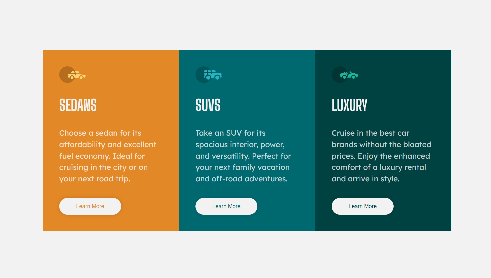

# 3-column preview card component 

## The challenge

Users should be able to:

- View the optimal layout depending on their device's screen size
- See hover states for interactive elements

## Built with

- Mobile-first workflow
- [React](https://reactjs.org/) - JS library
- [Styled Components](https://styled-components.com/) - For styles

  <h3>
    <a href= "https://react-3-column-card.netlify.app/">
      Live site
    </a>
     | 
    <a href= "https://www.frontendmentor.io/challenges/3column-preview-card-component-pH92eAR2-">
      Challenge
    </a>
  </h3>

This application/site was created as a submission to <a href= "https://www.frontendmentor.io/">Frontend Mentor Challenges</a> 
